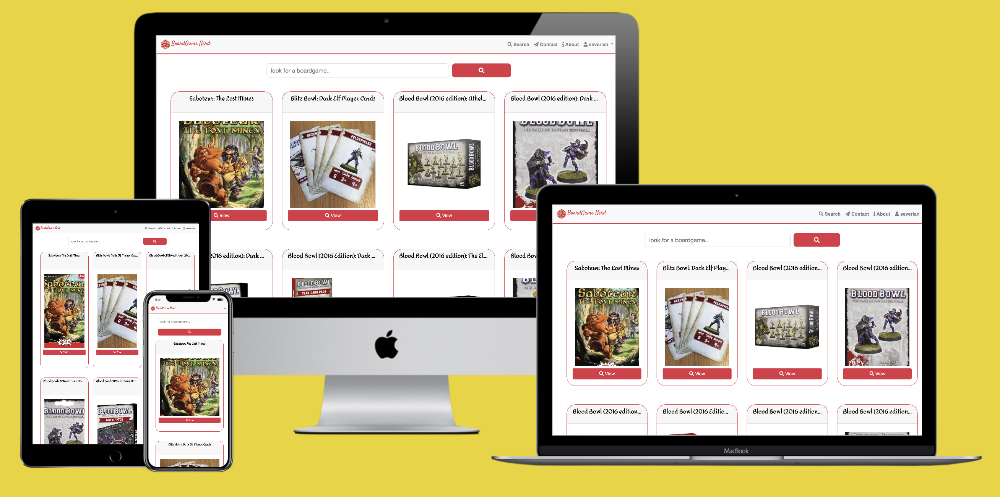

    <h1>  Boardgame Nerd </h1>

    <a href="https://boardgame-nerd.herokuapp.com/"> View  Live Website</a>

## Introduction

[BoardGame Nerd](https://boardgame-nerd.herokuapp.com/) has been created for Geek like me, who are passionate about Tabletop gaming. Are you looking for a way to catalogue your collection? Do you want to explore a big catalogue of all-time game? Or maybe do you want to stay
up-to-date with the latest new things coming out? In any case this is the right application for you.

## Table of Contents

1. [UX](#ux)
    - [User Stories](#user-stories)
    - [Wireframes](#wireframes)
1. [Features](#features)
    - [Existing Features](#existing-features)
        - [Navbar](#navbar)
        - [Footer](#footer)
        - [Landing Page](#landing-page)
            - [Search Section](#landing-page)
            - [Hot Carousel](#hot-carousel)
            - [Old Carousel](#old-carousel)
            - [Features](#features-section)

    - [Features Left to Implement](#features-left-to-implement)
1. [Information Architecture](#information-architecture)
    - [Database choice](#database-choice)
    - [Data Storage Types](#data-storage-types)
    - [Collections Data Structure](#collections-data-structure)
        - [Users Collection](#users-collection)
        - [Boardgame Collection](#boardgame-collection)
1. [Technologies Used](#technologies-used)
1. [Testing](#testing)
1. [Deployment](#deployment)
[Deployment](#deployment)
    - [Heroku Deployment](#heroku-deployment)
    - [How to run this project locally](#how-to-run-this-project-locally)
1. [Credits](#credits)
1. [Contacts](#contacts)
1. [Disclaimer](#disclaimer)

My project is leveraging *free xml API* from [BoardGameGeek](https://www.boardgamegeek.com/), Creating a 
back end architecture that supports a front end interface.

The *GUI* allows a the website visitor to do the following:

- Browse all the game in the DB.
- Get informed about all the latest game loved by the community.
- Get random games.
- Suggest to the webmaster any improvement.
- Add Games to a personal collection.
- Add notes to every game part of collection.

# UX

## User stories

As a user of BoardGame Archive I expect/need/want:

1. to search a wide catalogue of boardgame.
1. to be informed about what is hot in the boardgame community.
1. to add a boardgame to my collection.
1. to remove a boardgame to my collection.
1. to find the best fit game to the number of my friends, I want to filter my search results by 
   number of players.
1. to find the best fit game to the time I have, I want to filter my search results by 
   duration.
1. as a father/ mother, I want to know suggested age of a boardgame .
1. to add/update a rating to the boardgame I own.
1. to add/update a review to the boardgame I own.
1. to be able to connect to their social media channels, to be informed about new features.
1. to be easily in contact with the website manager via a contact form.
1. to have informative feedback from the website regarding the interaction, including a clear information
about loading status and pop up and modals when my actions are completed successfully.
1. to navigate the site also from mobile or from table, in way that the site is responsive to different
kind of device

## Wireframes

Wireframe mockups, created using [Balsamiq](https://balsamiq.com/), are available in diffent format:

 1. Laptop
    1. [Landing](wireframes/landing/LandingLaptop.pdf)
    1. [Search](wireframes/search/SearchLaptop.pdf)
    1. [Search Details](wireframes/searchDetails/SearchDetailsLaptop.pdf)
    1. [Collection](wireframes/collection/collectionLaptop.pdf)
    1. [Collection Details](wireframes/collectionDetails/collectionDetailsLaptop.pdf)
 1. Tablet
     1. [Landing](wireframes/landing/LandingTablet.pdf)
     1. [Search](wireframes/search/SearchTablet.pdf)
     1. [Search Details](wireframes/searchDetails/SearchDetailsTablet.pdf)
     1. [Collection](wireframes/collection/collectionTablet.pdf)
     1. [Collection Details](wireframes/collectionDetails/collectionDetailsTablet.pdf)
 1. Mobile
     1. [Landing](wireframes/landing/LandingMobile.pdf)
     1. [Search](wireframes/search/SearchMobile.pdf)
     1. [Search Details](wireframes/searchDetails/SearchDetailsLaptop.pdf)
     1. [Collection](wireframes/collection/collectionMobile.pdf)
     1. [Collection Details](wireframes/collectionDetails/collectionDetailsMobile.pdf)

Modal not dependent on the device:

   1. [Log in](wireframes/modal/loginModal.pdf)
   1. [Register](wireframes/modal/registerModal.pdf)

# Features

## Existing Features

### Elements on every page

#### Navbar

The navigation bar is fixed, and show a 20 faces dice on a site, that can be clicked to redirect the user to the main
page. On Flask *Back-end* the user is checked and the navbar can have 2 distinct aspect, whether the user is logged on or not; is worth to mention that all the controls and the status of the user are managed via the package `Flask session`

For visitors to the site who are not logged in, list items links are available for them to use.
        1. About
        1. Search
        1. Contact
        1. Log in
        1. Register

For users who are logged in, the list items are as follows:
        1. About
        1. Search
        1. Contact
        1. User's name (this option is a dropdown menu)
            - Collection
            - Settings
            - Log out

#### Footer

Footer is always present at the very end, and has been on purpose designed as minimal, containing the following information:
    - Copyright information.
    - Links to Facebook, Instagram and Twitter Pages, not existing at the moment.

#### Toast

All messages will be delivered from back-end to front-end via `Flask flash`, in which the level of warning will be specified, and this will give a specific colour to the toast:

- Success: green.
- Danger: red.
- Warning: yellow.

### Landing Page

Landing Page has been designed to capture the attention of the user getting there, proposing him 4 distinct options:

1. to search for a boardgame via keywords.
1. to explore what is hot in boardgame community at the moment.
1. to have a look to boardgames from the past.
1. to know more about the main features of the application.

#### Search Section

search section allows for a quick search directly from a box placed on top of the cover image, calling the flask API `search` and redirecting to the search page.

#### Hot Carousel

This will be one of the two carousel in the page, and is leveraging the **Hot** Api from [BoardGameGeek](https://www.boardgamegeek.com/); the API is returning between 60 and 70 elements that are visited the most from the end users of the above mentioned sites. 
The Carousel has been heavily customized, but is responsive, and programmatically append the next element to be shown. More details in the Credit sections, each element of the carousel is a card that is re-used as a `flask component`.

#### Old Carousels

The old carousel is retrieving 12 random elements from BoardGameGeek](https://www.boardgamegeek.com/) DB; it's purpose is to interest the visitors with old-school game, and most of customization is done at `Flask API` level, where  random game are generated, and those without thumbnails are excludede. Via a **JavaScript** the responsive hot carousels mechanism is re-used.  

#### Features section

The section is a responsive show-off via `FontAwesome` icons of the most important features of the site, via quick slogan, easy to be understood. The About link of the navbar links here.

### Detail Page

Detail page is reachable via Hot or Old Carousel in The home page or clicking the card returned by the search. The Detail page show the most important characteristics of a game, along with a button that allows the end user to add it to his/her collection.
Characteristic shown are the following:

* Description of a game.
* **Image** of the box.
* Year of publication.
* Minimum number of Players.
* Maximum number of Players.
* Duration.
* Category.
* Mechanics.
* Name of the Designer.
* Game Family.

if the user is not logged-on, he will get redirected to the log-in pages, clicking on Add.

### Search Page

This is accessible via the *home page*, or the *nav bar*. All the game returned will be shown with a responsive grid of cards, and details for each of them will be accessible clicking on them.

a message will be shown for user in case the search bears no results, or the user is coming from the navbar.

### Collection Page

This page will be accessible only if user is logged in from dropdown list. 

### Collection Detail Page

### Contact Page

### Login Page

### Registration Page

### Setting Page

### 404 Page

In case of *not found error*, the user is redirected to a generic page.

### 500 Page

In case of *internal server error*, the user is redirected to a generic page.

## Features Left to Implement
### Pagination and Infinity Scrolling

No *Pagination* is implemented at the moment, it could be coupled with an **infinity scrolling** features to show partial results and let end user scroll continously till the end of the results. 

### Filter on Collection Page

End users at the moment cannot filter on the boardgame returned by a search or on their own collections. Would be great to allow them this possibilities, however the number of categories are highly variables, and probably are coming from manual imputing, and this makes implementation of filtering hard to be useful.

### Pop Over on Cards

to allow the end user to have a glimpse about a boardgame's characteristics, will be nice to have a pop over when hovering over a card, showing a part of the description along, with some major characteristics.

### custom 404 and 500 page

page implemented for 404 and 500 page are standards, would be nice to find a nice design for them.

# Information Architecture
## Database Choice

a NoSQL database has been selected for his low latency response, keeping in mind the need to scale up 
increasing the number of user and query.
MongoDB was the optimal choice, being free of cost in his limited edition, good start, and with the possibility
to increase resource throwing more money to it.

The Design of Data didn't respect The 3NF, because NoSQL database are doing join poorly, and a level
of redundancy has been introduced, to speed up the response time.

## Data Storage Types
The types of data used in the project are:

* ObjectId
* String
* Integer
* Boolean
* DateTime
* Object

and some of them are collected into Arrays

## Collections Data Structure
the website relies on two database collections:

## Users Collection

| Title | Field Name | form validation type | Data type |
--- | --- | --- | --- 
Account ID | _id | None | ObjectId 
Name | username | text, `maxlength="40"` | string
Email Address | email | email, `maxlength="40"` | string
Password | password | text, `maxlength="15"` | string

#### BoardGame Collection

| Title | Key in db | form validation type | Data type |
--- | --- | --- | --- 
Boardgame relation ID | _id | None | ObjectId 
Username | username | text, `maxlength="40"` | string
Title | primary_name | text, `maxlength="50"` | string
BGG id | id | - | integer
Image Thumbnail | thumbnail| - | string
Image | image | - | string
Min Player | minplayers | - | integer
Max Player | maxplayers | - | integer
Playing Time | playingtime | - | integer
Min Playing Time | minplaytime | - | integer
Max Playing Time | maxplaytime | - | integer
Age | age | - | integer
Game Description | description | - | string
Language Dependence | language_dependence | - | string
List of category | boardgamecategory | - | Array(string)
List of mechanics | boardgamemechanic | - | Array(string)
List of family category | boardgamefamily | - | Array(string)
List of Designer| boardgamedesigner | - | Array(string)
List of Artist| boardgameartist | - | Array(string)
List of Publisher| boardgamepublisher | - | Array(string)
Date Bought | dateAdded | timepicker | datetime
Rating| rating | - | integer
User Review| review | `maxlength="200"` | string
 # Technologies Used

# Testing

# Deployment

## How to run this project locally

To run this project on your own IDE follow the instructions below:

Ensure you have the following tools: 
- An IDE such as [Visual Studio Code](https://code.visualstudio.com/)

The following **must be installed** on your machine:
- [PIP](https://pip.pypa.io/en/stable/installing/)
- [Python 3](https://www.python.org/downloads/)
- [Git](https://gist.github.com/derhuerst/1b15ff4652a867391f03)
- An account at [MongoDB Atlas](https://www.mongodb.com/cloud/atlas) or MongoDB running locally on your machine. 
- How to set up your Mongo Atlas account [here](https://docs.atlas.mongodb.com/).

## Heroku Deployment

To deploy to heroku, take the following steps:

1. Create a `requirements.txt` file using the terminal command `pip freeze > requirements.txt`.

2. Create a `Procfile` with the terminal command `echo web: python app.py > Procfile`.

3. `git add` and `git commit` the new requirements and Procfile and then `git push` the project to GitHub.

3. Create a new app on the [Heroku website](https://dashboard.heroku.com/apps) by clicking the "New" button in your dashboard. Give it a name and set the region to Europe.

4. From the heroku dashboard of your newly created application, click on "Deploy" > "Deployment method" and select GitHub.

5. Confirm the linking of the heroku app to the correct GitHub repository.

6. In the heroku dashboard for the application, click on "Settings" > "Reveal Config Vars".

7. Set the following config vars:

| Key | Value |
 --- | ---
DEBUG | FALSE
IP | 0.0.0.0
MONGO_URI | `mongodb+srv://<username>:<password>@<cluster_name>-qtxun.mongodb.net/<database_name>?retryWrites=true&w=majority`
PORT | 5000
ROOT_PASSWORD | `<your_secret_key>`

- To get you MONGO_URI read the MongoDB Atlas documentation [here](https://docs.atlas.mongodb.com/)

8. In the heroku dashboard, click "Deploy".

9. In the "Manual Deployment" section of this page, made sure the master branch is selected and then click "Deploy Branch".

10. The site is now successfully deployed.

# Contact
To contact me feel free to email

 `pdelbuono  (at)  gmail (dot) com`
 
# Disclaimer

The content of this website is educational purposes only.