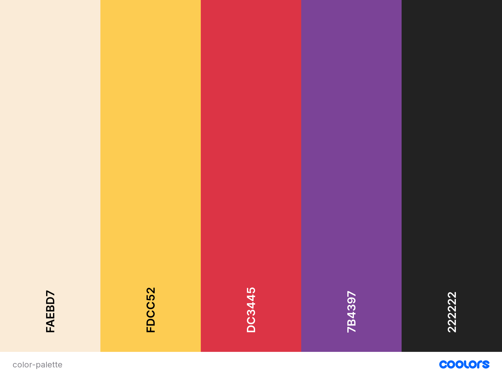

<div align="center">
    <h1>  Boardgame Nerd </h1>
</div>

<div align="center">
    <a href="https://boardgame-nerd.herokuapp.com/"> View  Live Website</a>
</div>

## Introduction

[BoardGame Nerd](https://boardgame-nerd.herokuapp.com/) has been created for Geek like me, who are passionate about Tabletop gaming. Are you looking for a way to catalogue your collection? Do you want to explore a big catalogue of all-time game? Or maybe do you want to stay
up-to-date with the latest new things coming out? In any case this is the right application for you.


## Table of Contents

1. [UX](#ux)
    - [User Stories](#user-stories)
    - [Design](#design)
        - [Framework](#framework)
        - [Color Scheme](#color-Scheme)
        - [Icons](#icons)
        - [Typography](#typography)
    - [Wireframes](#wireframes)
1. [Features](#features)
    - [Existing Features](#existing-features)
        - [Navbar](#navbar)
        - [Footer](#footer)
        - [Landing Page](#landing-page)
            - [Search Section](#landing-page)
            - [Hot Carousel](#hot-carousel)
            - [Old Carousel](#old-carousel)
            - [Features](#features-section)
        - [Search Page](#search-page)
        - [Detail Page](#detail-page)
        - [Collection Page](#collection-page)
            - [Collection Detail Page](#collection-detail-page)
        - [Login Page](#login-page)
        - [Contact Page](#contact-page)
        - [Registration Page](#registration-page)
        - [404 Page](#contact-page)
        - [500 Page](#registration-page)
    - [Features Left to Implement](#features-left-to-implement)
1. [Information Architecture](#information-architecture)
    - [Database choice](#database-choice)
    - [Data Storage Types](#data-storage-types)
    - [Collections Data Structure](#collections-data-structure)
        - [Users Collection](#users-collection)
        - [Boardgame Collection](#boardgame-collection)
1. [Technologies Used](#technologies-used)
    - [Tools](#tools)
    - [Libraries](#libraries)
1. [Testing](#testing)
1. [Deployment](#deployment)
    - [How to run this project locally](#how-to-run-this-project-locally)
    - [Heroku Deployment](#heroku-deployment)
1. [Credits](#credits)
    - [Contents](#contents)
    - [Code](#code)
    - [Images](#images)
    - [Acknowledgements](#acknowledgements)
1. [Contacts](#contacts)
1. [Disclaimer](#disclaimer)

My project is leveraging `free xml API` from [BoardGameGeek](https://www.boardgamegeek.com/), Creating a 
**back-end** architecture that supports a **front-end** interface.

The *GUI* allows the website visitor to do the following:

- Browse all the game in the DB.
- Get informed about all the latest game loved by the community.
- Get random old games.
- Get in contact with the webmaster to suggest any improvement.
- Add games to a personal collection.
- Add notes to every game part of collection.

# UX

## User stories

Following stories have been leading my design, and come before implementing and design my applications:

1. as a user I want to search a wide catalogue of boardgame. :white_check_mark:
1. as a user I need to be informed about what is hot in the boardgame community. :white_check_mark:
1. as a user I like to be informed about what nice old boargame from the past. :white_check_mark:
1.  as a user I need to add a boardgame to my personal collection. :white_check_mark:
1.  as a user I need to remove a boardgame to my personal collection. :white_check_mark:
1.  as a user I expect to find the best fit game to the number of my friends, visualizing it on screen. :white_check_mark:
1. as a user I expect to find the best fit game to the time I have, visualizing  it on screen. :white_check_mark: 
1.  as a father/ mother, I need to visualize suggested age of a boardgame. :white_check_mark:
1. as a user I like to add/update a rating to the boardgame I own. :white_check_mark: 
1.  as a user I like to add/update a review to the boardgame I own. :white_check_mark:
1.  as a user I expect to be able to connect to their social media channels, to be informed about new features. :white_check_mark:
1.  as a user I expect to be easily in contact with the website manager via a contact form. :white_check_mark:
1.  as a user I want to have informative feedback from the website regarding my interaction, including  loading status , pop-up and toast when my actions are completed successfully or when my searches are empty. :white_check_mark:
1. as a user I expect to navigate the site also from mobile or from tablet, in way that the site is responsive and enjoyable on different kind of device :white_check_mark:

## Design
### Framework
- [jQuery](https://code.jquery.com/jquery/)
    - **jQuery** for its semplicity of use has been selected to improve reactivity of the site. It was not possible to use minified version or latest version( 3.5.1) for compatibility issues.
- [Flask](http://flask.pocoo.org/)
    - Flask is an elegant micro-framework that I leveraged along with his template engine **Jinja2**.
### Color Scheme
Following color Palette has been adopted; the main background color used is Crayola(`#FDCC52`) or Antique White(`#FAEBD7`) as an alternative; those two colours are dominating the application. Other Elements, such Button and Navbar are using Rusty Red (`#DC3445`) or a gradient of it with maximum Purple(`#7B4397`). Eerie Black(`#222222`) has been used as an element of contrast, in the footer or for some button.


### Icons
- [Font Awesome 5.13](https://fontawesome.com/) 
    - all icons have been source from more than 1000 available in fontawesome.
### Typography
I have used some [Google Fonts](https://fonts.google.com/) all over the Website: 
* I have selected for all titles [Amita](https://fonts.google.com/specimen/Amita), because it seems appropriate for the Fantastic settings many Boardgames have. 
* I have used also [Satisfy](https://fonts.google.com/specimen/Satisfy) for Brand logo.
* Beside those, all others font are the build-in Bootstrap ones.

## Wireframes

Wireframe mockups, created using [Balsamiq](https://balsamiq.com/), are available in diffent format:

 1. Laptop
    1. [Landing](wireframes/landing/LandingLaptop.pdf)
    1. [Search](wireframes/search/SearchLaptop.pdf)
    1. [Search Details](wireframes/searchDetails/SearchDetailsLaptop.pdf)
    1. [Collection](wireframes/collection/collectionLaptop.pdf)
    1. [Collection Details](wireframes/collectionDetails/collectionDetailsLaptop.pdf)
 1. Tablet
     1. [Landing](wireframes/landing/LandingTablet.pdf)
     1. [Search](wireframes/search/SearchTablet.pdf)
     1. [Search Details](wireframes/searchDetails/SearchDetailsTablet.pdf)
     1. [Collection](wireframes/collection/collectionTablet.pdf)
     1. [Collection Details](wireframes/collectionDetails/collectionDetailsTablet.pdf)
 1. Mobile
     1. [Landing](wireframes/landing/LandingMobile.pdf)
     1. [Search](wireframes/search/SearchMobile.pdf)
     1. [Search Details](wireframes/searchDetails/SearchDetailsLaptop.pdf)
     1. [Collection](wireframes/collection/collectionMobile.pdf)
     1. [Collection Details](wireframes/collectionDetails/collectionDetailsMobile.pdf)

Modals not dependent on the device:

   1. [Log in](wireframes/modal/loginModal.pdf)
   1. [Register](wireframes/modal/registerModal.pdf)

# Features

## Existing Features

### Elements on every page

#### Navbar

The navigation bar is fixed, and show a 20 faces dice on a site, that can be clicked to redirect the user to the main
page. On *Flask* **back-end** the user is checked and the navbar can have 2 distinct aspect, whether the user is logged on or not; is worth to mention that all the controls and the status of the user are managed via the package `Flask session`; there is also a strong emphasis on defensive design in **back-end**, to prevent rogue navigation to section which require log-in.

For visitors to the site who are not logged in, list items links are available for them to use.

1. About
1. Search
1. Contact
1. Log in
1. Register

For users who are logged in, the list items are as follows:

1. About
1. Search
1. Contact
1. User's name this option is a dropdown menu with following items:

    - Collection
    - Settings
    - Log out

#### Footer

Footer is always present at the very end, and has been on purpose designed as minimal, containing the following information:

- Copyright information.
- Links to Facebook, Instagram and Twitter Pages for `Boardgame Nerd`, not existing at the minute.

#### Toast

All messages will be delivered from back-end to front-end via a `Flask flash`, in which the level of warning will be specified, and in case of danger or warning will give a specific colour to the toast:

- Danger: red.
- Warning: yellow.


### Landing Page

Landing Page has been designed to capture the attention of the user getting there, proposing him 4 distinct options:

1. to search for a boardgame via keywords.
1. to explore what is hot in boardgame community at the moment.
1. to have a look to boardgames from the past, selected random by a package.
1. to know more about the main features of the application.
1. a contact section that allows to send mail to the owner of the site.


#### Search Section

search section allows for a quick search directly from a box placed on top of the cover image, calling the flask API `search` and redirecting to the search page. The **Back-end** is executing behind the scene 2 APIs call, because the **search** API provided by [BoardGameGeek](https://www.boardgamegeek.com/) only return thumbnail, and a different level of enrichment is necessary, along with results wrangling.

#### Hot Carousel

This will be one of the two carousel in the page, and is leveraging the **Hot** API from [BoardGameGeek](https://www.boardgamegeek.com/); the API is returning between 60 and 70 elements that are visited the most from the end users of the above mentioned sites, and it's updated real-time
The Carousel has been heavily customized, but is responsive, and programmatically append the next element to be shown when the navigations controls are toggled. More details in the Credit sections, each element of the carousel is a card that is re-used as a `flask component`.

#### Old Carousel

The old carousel is retrieving 12 random elements from [BoardGameGeek](https://www.boardgamegeek.com/) DB; its purpose is to interest the visitors with old-school game, and most of customization is done at `Flask API` level, where  random game are generated, and those without thumbnails are excluded. Via a **JavaScript** the responsive hot carousels mechanism is re-used.  <ins>This element is dynamical and every visit will bear a different result.</ins>

#### Features section

The section is a responsive show-off via `FontAwesome` icons of the most important features of the site, via quick slogan, easy to be understood. The **About** link of the navbar links here.

### Detail Page

Detail page is reachable via Hot or Old Carousel in The home page or clicking the card returned by the search. The Detail page show the most important characteristics of a game, along with a button that allows the end user to add it to his/her collection.
Characteristic shown are the following:

- Description of a game.
- **Image** of the box.
- Year of publication.
- Minimum number of Players.
- Maximum number of Players.
- Duration.
- Category.
- Mechanics.
- Name of the Designer.
- Game Family.

<ins>if the user is not logged-on, he will get redirected to the log-in pages, clicking on Add.</ins>

### Search Page

This is accessible via the *home page*, or the *nav bar*. All the game returned will be shown with a responsive grid of cards, and details for each of them will be accessible clicking on them.

A message will be shown for user in case the search bears no results, or the user is coming from the navbar.
Behind the scene the `Search flask API`, will run two API calls, this because the original *BGG search API* doesn't return anything else beside the game id and its description: the second call will enrich the ids with thumbnail to show up in the cards.
The **search** API provided by [BoardGameGeek](https://www.boardgamegeek.com/) presented many corner cases that have been managed at **back-end** side.

### Collection Page

This page will be accessible only if user is logged in from dropdown list; it will be similar to the search results page, but only game belonging to a collection will be shown, with the same grid of responsive cards. The only add-on will be a remove button on each card to quickly remove them from collection, and edit button that will allow navigation to the **Collection Detail Page**

#### Collection Detail Page

Collection Details page will be similar to the detail page, but here the user will have a couple of buttons, one to save and one to remove the game from his/her collection. Here the user can input or update some traits that will be unique for the game part of his/her collection, in particular:

- Date of acquisition, with a date-picker item.
- Rating, with a 5 star radio button.
- Notes, with a text area.

### Contact Section

Here visitors can send suggestions or get in touch with me; the form is making use of [email.js](https://www.emailjs.com/) behind the scene, and their API gets invoked by a `fetch Javascript API`. The user is warned about the results of his/her action by a toast.

### Login Page

User can login in a dedicated page, where he can alternatively user *email* or *username*. He gets warned about login status by a toast and re-directed to collection page in case of success.

In the `Flask API` access to this page by user already logged in are prevented. In back-end, python procedure will check on `MongoDB` about correctness of the password and existence of the user.

### Registration Page

User can register in a dedicated page, where he must input the following:

- *email*
- *username*
- *password*

He gets warned about login status by a toast and re-directed to collection page in case of success; In the `Flask API` access to this page by user already logged in are prevented.
In back-end, python procedure will check on `MongoDB` about whether *username* and *password* are already in use or not.

### Setting Page

This is the page where logged user has the possibility to change his/her password or mail. <ins>Consistency check will be performed by python procedure on `MongoDB`</ins>.

### 404 Page

In case of *not found error*, the user is redirected to a generic page, showing dices pictures.

### 500 Page

In case of *internal server error*, the user is redirected to a generic page, showing dices pictures.

## Features Left to Implement

### Pagination and Infinity Scrolling

No *Pagination* is implemented at the moment, it could be coupled with an **infinity scrolling** features to show partial results and let end user scroll continously till the end of the results.

### Filter on Collection Page

End users at the moment cannot filter on the boardgame returned by a search or on their own collections. Would be great to allow them this possibilities, however the number of categories are highly variables, since they are coming from manual imputing, and this makes implementation of filtering really hard to be useful.

### Pop Over on Cards

To allow the end user to have a glimpse about a Boardgame's characteristics, will be nice to have a pop over when hovering over a card, showing a part of the description along, with some major characteristics.

### Automated test

Application would benefit from implementation of automated tests with *Jasmine* for the front-end, and *pytest* for the back-end.


# Information Architecture

## Database Choice

a NoSQL database has been selected for his low latency response, keeping in mind the need to scale-up, increasing the number of users and queries accessing concurrently.
MongoDB was the optimal choice, being free of cost in his limited edition, so perfect to have a **Minimum Viable Product**, and with the possibility to increase resource throwing more money to it.

The Design of Data didn't respect The [Third Normal Form](https://en.wikipedia.org/wiki/Third_normal_form), a design rules to prevent redundancy, because NoSQL database are doing join poorly, and therefore for a precise choice, space on DB has been traded-off in order to speed up the response time of accessing Collections.

## Data Storage Types

The types of data used in the project are:

- ObjectId
- String
- Integer
- Boolean
- DateTime
- Object

and some of them are collected into Arrays.

## Collections Data Structure

the website relies on two database collections:

### Users Collection

| Title | Field Name | form validation type | Data type |
--- | --- | --- | --- 
Account ID | _id | None | ObjectId 
Name | username | text, `maxlength="40"` | string
Email Address | email | email, `maxlength="40"` | string
Password | password | text, `maxlength="15"` | string

### BoardGame Collection

| Title | Key in db | form validation type | Data type |
--- | --- | --- | ---
Boardgame relation ID | _id | None | ObjectId
Username | username | text, `maxlength="40"` | string
Title | primary_name | text, `maxlength="50"` | string
BGG id | id | - | integer
Image Thumbnail | thumbnail| - | string
Image | image | - | string
Min Player | minplayers | - | integer
Max Player | maxplayers | - | integer
Playing Time | playingtime | - | integer
Minimum Age | Minage | - | integer
Game Description | description | - | string
List of category | boardgamecategory | - | Array(string)
List of mechanics | boardgamemechanic | - | Array(string)
List of family| boardgamefamily | - | Array(string)
List of Designer| boardgamedesigner | - | Array(string)
Date Bought | dateAdded | timepicker | datetime
Rating| rating | - | integer
User Review| note | `maxlength="200"` | string

# Technologies Used

Site was mostly developed relying on `HTML`, `Python`, `JavaScript` and `CSS`.

## Tools

- [Visual Studio Code](https://code.visualstudio.com/) as **IDE**.
- [PIP](https://pip.pypa.io/en/stable/installing/) as **package manager**.
- [Git](https://gist.github.com/derhuerst/1b15ff4652a867391f03) as **version control tool**.
- [GitHub](https://github.com/) as **code repository**.
- [MongoDB Atlas](https://www.mongodb.com/cloud/atlas) as **Database Management Tool**.
- [TechSini Multi-Mockup](https://techsini.com/multi-mockup/index.php) to create mockup image.

## Libraries

- [JQuery](https://jquery.com) to access and Manipulate the **DOM**.
- [Bootstrap](https://www.bootstrapcdn.com/) to speed up pages design, providing responsiveness out of the box.
- [FontAwesome](https://www.bootstrapcdn.com/fontawesome/) to provide icons ready to use.
- [PyMongo](https://api.mongodb.com/python/current/) to manipulate data on MongoDB via `Python` methods.
- [Flask](https://flask.palletsprojects.com/en/1.0.x/) to build API and render Pages or redirect user's calls.
- [Jinja2](http://jinja.pocoo.org/docs/2.10/) to programmatically build web pages from templates.
- [xmltoDict](https://pypi.org/project/xmltodict/) Python Library used to parse API XML response into *Ordered Dictionaries*.
- [Email.js](https://emailjs.com/) to send mail from Contact Page.

# Testing

To testing has been dedicated this [section](testing.md).

# Deployment

## How to run this project locally

To run this project on your own IDE follow the instructions below, and ensure you have the following tools:

- An IDE such as [Visual Studio Code](https://code.visualstudio.com/)

And the following tools, <ins> that  must be installed on your machine </ins>:

- [PIP](https://pip.pypa.io/en/stable/installing/)
- [Python 3](https://www.python.org/downloads/)
- [Git](https://gist.github.com/derhuerst/1b15ff4652a867391f03)
- An account at [MongoDB Atlas](https://www.mongodb.com/cloud/atlas) or MongoDB running locally on your machine. 

### Installation

the following instruction applies to `MacOS` or `Linux` environment, for Windows please find the following [this link](https://packaging.python.org/guides/installing-using-pip-and-virtual-environments/) on how to activate an enviroment, and install  modules from requirements file.

1. clone locally the github repository with the following command.

    ```
    git clone https://github.com/severian5it/BoardGameNerd.git
    ```

1. A virtual environment will make all the installation and developer easy to implement. Start The Virtual environment with following command.

    ```
    python3 -m .venv venv
    ```  

1. Activate the virtual environment

    ```
    .venv\Scripts\activate 
    ```


1. upgrade local version of pip if needed:

    ```
    pip3 install --upgrade pip.
    ```

1. Install all required modules with the command:

    ```
    pip3 -r requirements.txt.
    ```

1. In your local IDE create a file called `.flaskenv`, this will contain all the system variable

1. Inside the .flaskenv file, create a SECRET_KEY containing a string and a MONGO_URI to link to your own database; also a DEBUG variable equals to 1 can assist the development. 

1. Create in **MongoDB** a database containing two collections: `users`, and `collection`.

1. You can now run the application with the command
    ```
    python3 -m BoardgameNerd.webapp
    ```

1. You can interact with application visiting at `http://127.0.0.1:5000`.

## Heroku Deployment

To deploy to heroku, take the following steps:

1. Create a `requirements.txt` file using the terminal command `pip freeze > requirements.txt`.

1. Create a `Procfile` with the terminal command `echo web: python app.py > Procfile`.

1. `git add` and `git commit` the new requirements and Procfile and then `git push` the project to GitHub.

1. Create a new app on the [Heroku website](https://dashboard.heroku.com/apps) by clicking the "New" button in your dashboard. Give it a name and set the region to Europe.

1. From the heroku dashboard of your newly created application, click on "Deploy" > "Deployment method" and select GitHub.

1. Confirm the linking of the heroku app to the correct GitHub repository.

1. In the heroku dashboard for the application, click on "Settings" > "Reveal Config Vars".

1. Set the following config vars:

    | Key | Value |
    --- | ---
    IP | 0.0.0.0
    MONGO_URI | `mongodb+srv://<username>:<password>@<cluster_name>-qtxun.mongodb.net/<database_name>?retryWrites=true&w=majority`
    PORT | 5000
    ROOT_PASSWORD | `<your_secret_key>`

    To get you MONGO_URI read the MongoDB Atlas documentation [here](https://docs.atlas.mongodb.com/)

1. In the heroku dashboard, click "Deploy".

1. In the "Manual Deployment" section of this page, made sure the master branch is selected and then click "Deploy Branch".

1. The site is now successfully deployed.

# Credits

## Content

Inspiration for this site has been [BoardGameGeek](https://www.boardgamegeek.com/), incredible resource for Boardgame lovers, and in particular I followed this [post](https://boardgamegeek.com/wiki/page/BGG_XML_API2) to know about the *XML API*.

## Code

I took inspiration from many resources on the web for my site, but in a most significant way:

- Structure of the page and graphic is inspired by this **startbootstrap** [template](https://startbootstrap.com/themes/landing-page/) 
- The Responsive multi-item carousel on landing page has been develoed from this [code snippet](https://azmind.com/bootstrap-carousel-multiple-items) and credit goes to Iatek LLC 2018.
- Cards hovering effect have been adapted by this [code snippet](https://codepen.io/andrewsims/pen/mQoYwz*/).
- Keeping Card same size has been adapted following this [thread](https://stackoverflow.com/questions/37287153/how-to-get-images-in-bootstraps-card-to-be-the-same-height-width).
- Star Rating Radio Button has been adapted by this [code snippet](https://codepen.io/yaworek/pen/JJpEaZ*/).
- Project scaffolding has been developed following this [post](https://code.visualstudio.com/docs/python/tutorial-flask) on how to develop a Flask Project on *VSCode*.

I feel important also to recommend for *Flask* the following resources:
- The youtube channel of [Corey Schafer](https://www.youtube.com/watch?v=MwZwr5Tvyxo&list=PL-osiE80TeTs4UjLw5MM6OjgkjFeUxCYH).
- The Blog of [Miguel Grinberg](https://blog.miguelgrinberg.com/post/the-flask-mega-tutorial-part-i-hello-world), with his fantastic **Flask Mega-Tutorial**.
## Images

The photo used in the Landing section was downloaded from [Unsplash](https://unsplash.com/), and credit goes to [*Christopher Paul High*](https://unsplash.com/@christopherphigh).

Dice images for **404** and **500** pages are coming from [freepik.com](https://www.freepik.com/) 

## Acknowledgements

Many thanks to [Simen Daehlin](https://github.com/Eventyret), he was great with his continous suggestions and push for improvements.

# Contact

To contact me feel free to email

 `pdelbuono  (at)  gmail (dot) com`
 

# Disclaimer

The content of this website is educational purposes only.
