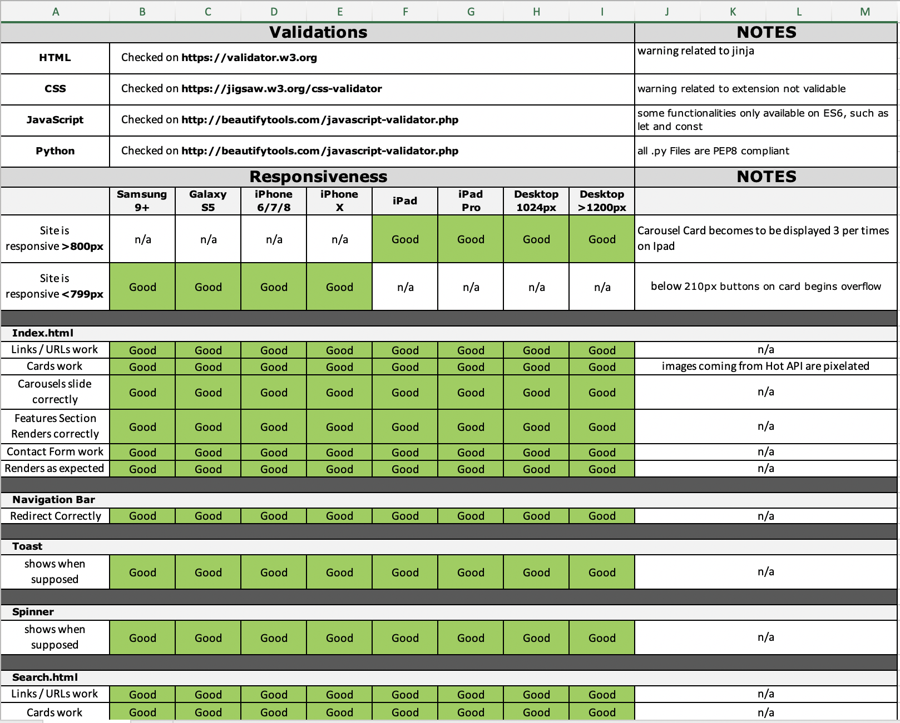

1. [Testing](#testing)
    - [Manual Testing](#manual-testing)
    - [Bugs](#bug)

# Testing

## Manual Testing

I used following onlyvalidator to check the validity of the website code:

* **CSS**: [W3C CSS Validation Service](https://jigsaw.w3.org/css-validator/) 
* **HTML**: [W3C Markup Validation Service](https://validator.w3.org/)
* **JavaScript**: [JavaScript Beautify Tools](http://beautifytools.com/javascript-validator.php)
* **Python**: [PEP8 online tools](http://pep8online.com/)

For JavaScript and Python I also used extension of Vscode; the work has been reviewed by a number of relatives and friend, mostly on the mobile,
each of them giving suggestions.

The website has been test with multiple resizing to test the its responsiveness.
via the *inspect* **chrome devtool** functionality it has been examined for the most popular mobile devices such as 
* Samsung 9+
* iPhone 6/7/8
* iPhone X
* iPad
* iPad Pro
* Galaxy S5

also following section has been tested:

1. Navbar: navigating through different pages, including home pages, ensuring that, being *fixed*, was never covering any content.

1. Footer: checking if footer was standing on the bottom of the page, never overlaying other content and that all its links were working properly.

1. Spinner: ensuring that spinner display correctly

1. Landing Page, via the following routine
    - **Search Section** properly redirect me to Search Results.
    - **Hot Carousel** is showing me the resultes of `Hot API` call, and responds correctly to screen resizing.
    - **Hot Carousel** is redirecting me correctly to detail page chosen.
    - **Oldie Carousel** is showing me the resultes of Random Procedure , and responds correctly to screen resizing.
    - **Oldie Carousel** is redirecting me correctly to detail page chosen.
    - **Feature Section** is responsive and its element don't overlap/

1. Login, checking it works, and I'm prevent to access with wrong or not-existing user/password couple.

1. Registration, checking it works, and I'm prevent to register with already used username or mail.

1. Search via the following routine: 
    - Calling different games, and seeing the results displayed properly in cards. 
    - Checking that **empty results** are showed differently. 
    - Checking also that the search on landing page works properly

1. Contact via the following routine:
    - Going to the "Contact" Section
    - Trying to submit the empty form and verify that an error message about the required fields appears
    - Trying to submit the form with an invalid email address and verify that a relevant error message appears
    - Trying to submit the form with all inputs valid and verify that the mail is sent correctly.

1. Detail Page, via the following routine:
    - Checking that all details are displayed properly
    - Checking that I can add to my collection if I'm Logged in
    - Checking that I'm redirected to log-in page if I'm not logged and I try to add.

1. Collections Page, via the following routine:
    - Checking that *empty results* special page is shown
    - Checking that only *boardgames* belonging to the right user are shown
    - Checking the deletion is working, upon the call of a *modal*
    - Check that edit sends me to the edit page.

1. Collection Item, via the following routine:
    - Checking that all details are displayed properly
    - Checking that I can edit Date, Ratings and Notes
    - Checking the deletion is working, upon the call of a *modal*

1. Settings Page, checking whether allow to change *mail* an *password* and prevents in case of wrong password given.

I kept track of all the test on this [matrix](BoardgameNerd/test/manualTests.xlsx)

## Bugs

Most of the bugs were related to the **XML API** results that were converted in Ordered Dictionaries; wrangling them had many corner cases. Other bugs were caused by jQuery compability, such as:
* 3.5 version of jQuery was causing problems toggling the navbar, and I bounced it down to version 3.4.1
* Minified version of jQuery then it wasn't implementing the method `Fadeout`, to use with the Spinner, and it was replaced by full version.
* Method `Fadeout` was also called late on some mobile engine, causing the spinner to never go away, hampering the navigation. To solve it I changed the sequence of its loading.
